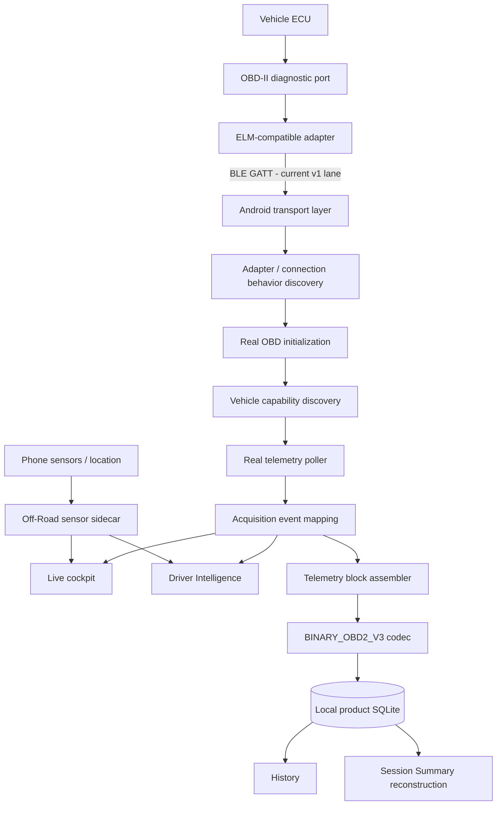
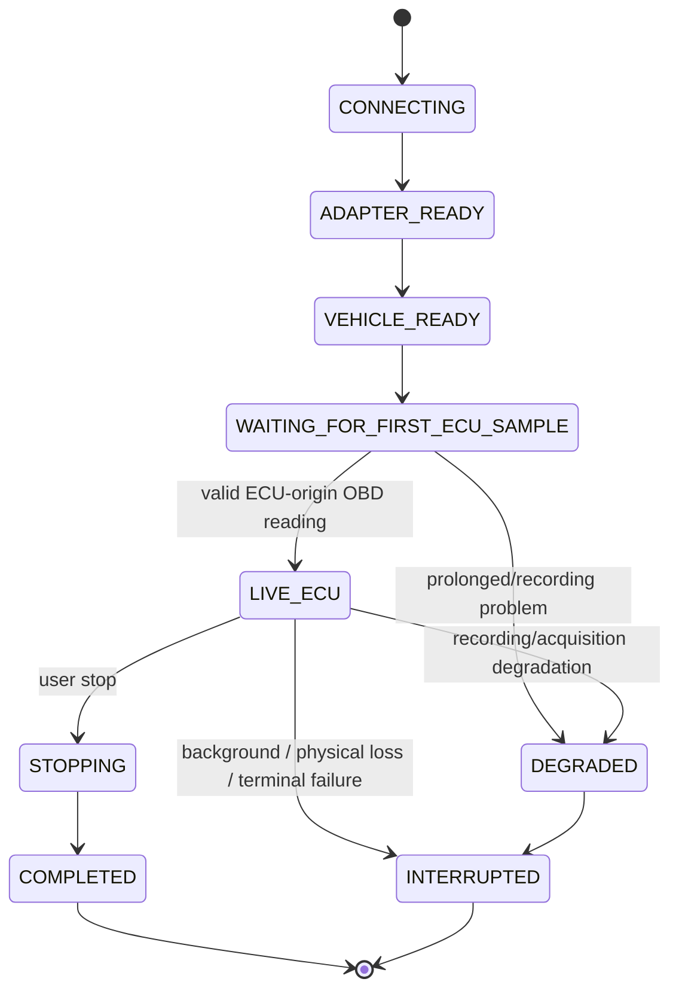
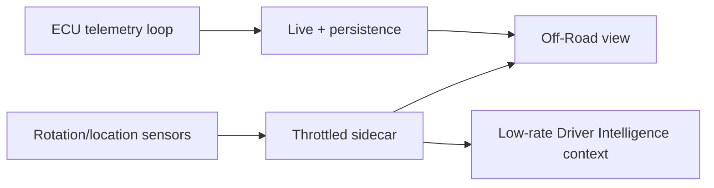

# AutoPulse — Current Architecture

**Status:** current v1 architecture summary
**Detailed design authority:** `docs/design/AUTOPULSE_SYSTEM_DESIGN.md`

This document replaces the older backend-centric description. The current AutoPulse Live v1 release path is an Android, local-first, read-only vehicle intelligence application.

The historical `backend/` and other repository experiments may remain available for research/future work, but they are not required for the core Live v1 runtime.

## 1. Runtime architecture



Critical rule: the phone-sensor sidecar cannot own, reset or starve the ECU/OBD request-response path.

## 2. Architectural layers

### 2.1 Transport and adapter behavior

Responsibilities:

- discover/connect physical BLE adapter;
- retain connection into initialization;
- characterize adapter behavior;
- expose disconnection;
- keep adapter/transport errors distinct from vehicle `NO_DATA`.

Reported branding/firmware is evidence, not authority.

### 2.2 OBD initialization and protocol evidence

Responsibilities:

- configure supported ELM-compatible behavior;
- establish a read-only diagnostic request/response path;
- use automatic protocol selection where appropriate;
- treat `A0` as provisional automatic-selection evidence;
- re-query/present protocol only when real exchange supplies sufficient evidence.

No raw AT/CAN configuration should be required from the normal user.

### 2.3 Vehicle capability discovery

AutoPulse separates:

- `STANDARD_DEFINITION`;
- `CAPABILITY_ADVERTISED`;
- `PROBE_RESULT`;
- `LIVE_OBSERVATION`.

A PID being known to the OBD standard does not prove the current vehicle supports it.

### 2.4 Real telemetry polling

The poller issues requests only for the active supported/operational set.

Important semantics:

- repeated `NO_DATA` may retire a PID from the active poll loop after the required evidence count;
- operational retirement does not rewrite historical capability truth;
- TIMEOUT/adapter errors/connection loss are different from vehicle `NO_DATA`;
- any valid ECU-origin OBD reading can establish ECU-live truth.

### 2.5 Acquisition events

Raw command outcomes are normalized into source-aware acquisition events.

The event layer is used for:

- Live UI updates;
- Driver Intelligence;
- telemetry block assembly;
- durable reconstruction.

### 2.6 Durable telemetry blocks

The current product format is `BINARY_OBD2_V3`.

Events are grouped into fixed-duration windows and persisted through a bounded commit queue.

Normal Stop performs a final flush. The last window may be shorter than the fixed block duration and remain marked as a partial **block**. That does not automatically mean the whole normal session is PARTIAL.

### 2.7 Product database

The current Live v1 path uses local product SQLite as the durable authority for:

- workspace/local context;
- vehicle records;
- Live sessions;
- telemetry block metadata/payloads;
- History;
- session reconstruction/recovery metadata.

The app does not require MongoDB or a remote account for core Live operation.

## 3. Source-truth architecture

### ECU direct

Examples:

- RPM;
- vehicle speed;
- coolant temperature;
- other supported Mode 01 readings.

### Adapter origin

Example:

- `ATRV` adapter/supply voltage.

It is never equivalent to ECU/control-module voltage PID `0142`.

### Phone origin

Examples:

- pitch/roll orientation source;
- altitude/location;
- heading.

These are never labeled ECU data.

### Derived

Calculated/estimated values retain their provenance and are never relabeled as direct ECU measurement.

## 4. Live state machine

Conceptual state flow:



Initialization completion is not enough to move to healthy Live.

Adapter-only data cannot unlock ECU Live.

## 5. Live session controller

The real controller owns:

- active OBD controller/poller;
- AppState observation;
- physical BLE disconnect observation;
- event sequence;
- telemetry assembler;
- commit queue;
- one terminal promise/state.

Release-1 lifecycle policy:

- recording is foreground-only;
- leaving foreground while ACTIVE produces explicit `APP_BACKGROUND` interruption;
- physical adapter disconnect produces explicit connection-related interruption;
- terminal races converge on one terminal outcome;
- bounded persistence drain prevents indefinite STOPPING/FLUSHING.

## 6. Process-kill recovery

A JavaScript app cannot reliably intercept abrupt OS process termination.

AutoPulse therefore recovers on next boot:

```text
app start
→ DB migration/bootstrap
→ inspect orphan nonterminal sessions
→ read durable telemetry block facts
→ reconcile counters/last sequence/end evidence
→ mark INTERRUPTED
→ reason UNEXPECTED_APP_TERMINATION unless stronger prior reason
→ History/Summary use surviving evidence
```

Missing tail data is never invented.

## 7. Session Summary architecture

Summary reconstruction reads persisted session + telemetry blocks through the product codec.

Integrity categories:

- COMPLETE;
- PARTIAL;
- DEGRADED;
- CORRUPTED;
- UNAVAILABLE.

Important rules:

- corruption/unsupported blocks/gaps/mismatches prevent false completeness;
- interrupted sessions remain partial according to surviving evidence;
- one expected shorter final user-stop flush may coexist with session-level COMPLETE;
- Android/Hermes runtime uses a safe UTF-8 path rather than assuming global `TextDecoder` exists.

## 8. History architecture

History queries durable sessions and presents:

- vehicle;
- timestamp;
- terminal status;
- duration;
- block/read counts;
- termination reason;
- session identifier;
- reconstructed Summary action for eligible terminal sessions.

History is a product evidence surface, not merely a trip list.

## 9. Driver Intelligence

Driver Intelligence consumes normalized telemetry/context and produces driver-oriented state/advisories.

Driver Modes:

- Essential;
- Family / Daily;
- Performance;
- Off-Road;
- Diagnostic.

Modes alter prioritization, not telemetry truth.

A mode cannot mark a dimension READY when its required evidence is missing/degraded.

## 10. Phone-first cockpit architecture

The screen is designed for a smartphone viewport.

Priority:

```text
critical/attention event
→ vehicle/session context
→ primary telemetry
→ selected mode context
→ trends/details
```

Healthy Live does not display a permanent large `LIVE · ECU DATA` banner. A small healthy indicator is sufficient.

Transitional/abnormal states use stronger banners.

## 11. Voice / color / haptic architecture

Normal state is quiet.

- green: healthy/available;
- amber: waiting/partial/degraded attention;
- red: critical/terminal interruption.

Voice is event-driven and explains meaning/action rather than reading every numeric sample.

Haptics reinforce warning/critical transitions and are rate-limited with alert policy.

## 12. Off-Road sidecar architecture



Rules:

- no location permission dialog during ACTIVE Live;
- use existing permission only;
- missing permission degrades location-derived feature, not ECU path;
- lower sensor/update budget protects JS/ELM timing;
- vehicle-relative pitch/roll require calibration;
- unresolved altitude is unavailable, not zero.

RC4 was created specifically to enforce this architecture after Duster RC3 field evidence showed Off-Road could destabilize the ECU/session path.

## 13. Legacy/future backend components

The repository contains backend/web experiments from an earlier architecture.

They should be treated as legacy/future work unless explicitly promoted back into the v1 Design/Plan.

Current core release promise does not require:

- FastAPI ingestion;
- MongoDB;
- WebSocket streaming to a web dashboard;
- Isolation Forest backend prediction;
- cloud authentication.

If these capabilities return, they need a new architectural decision and cannot silently become release dependencies.

## 14. Documentation/evidence architecture

Engineering truth flows through:

```text
brainstorming
→ design
→ plan
→ build
→ test
→ mining-site/quarries
→ golden-dataset
→ release
```

See `docs/README.md` for authority rules.
