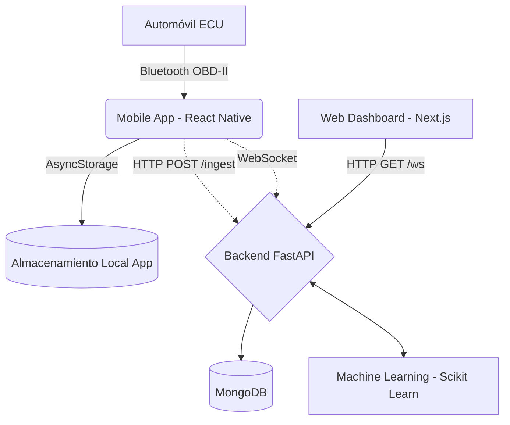

# Documentación de Arquitectura - AutoPulse 🚗⚡

## 1. Visión General
**AutoPulse** es una plataforma inteligente de monitoreo vehicular diseñada para conectarse a la computadora del auto (ECU) mediante un adaptador OBD-II Bluetooth (ELM327). Extrae telemetría en tiempo real (RPM, velocidad, temperatura, flujo de aire, códigos de error), la evalúa mediante modelos de Machine Learning para detectar anomalías y provee interfaces para el conductor (App Móvil) y administradores/mecánicos (Web Dashboard).

---

## 2. Diagrama de Arquitectura

El sistema se compone de tres piezas principales conectadas entre sí:

*(Nota: Las flechas punteadas indican funcionalidades que el backend soporta pero que faltan por integrar en la aplicación móvil actual).*

---

## 3. Componentes del Sistema

### 3.1. Backend (API & Machine Learning)
- **Tecnologías**: Python 3, FastAPI, Motor (MongoDB Async), Scikit-Learn.
- **Ubicación**: Carpeta `/backend`
- **Módulos Principales**:
  - `app/api/routes/telemetry.py`: Define los endpoints para ingestar datos (`/ingest`), consultar históricos (`/range`, `/latest`), y conexiones en tiempo real (`/ws/{vehicle_id}`).
  - `app/api/routes/vehicles.py`: CRUD de vehículos asociados a usuarios.
  - `app/ml/anomaly_detector.py`: Implementa **Isolation Forest**. Un modelo de inteligencia artificial que se entrena mediante el endpoint `/train-model` con datos históricos para detectar si una nueva lectura (ej. RPM muy altos y velocidad baja) es una anomalía de comportamiento.
  - `app/models/telemetry.py`: Define la estructura de datos que viaja al backend (RPM, speed, coolant_temp, engine_load, throttle_pos, dtc_codes, etc.).

### 3.2. Aplicación Móvil (Conductor)
- **Tecnologías**: React Native (Expo), TypeScript, `react-native-bluetooth-classic`.
- **Ubicación**: Carpeta `/mobile-app`
- **Módulos Principales**:
  - `src/services/bluetoothOBD.ts`: El corazón de la comunicación con el vehículo. Usa comandos "AT" para configurar el ELM327 y luego envía PIDs hexagonales (ej. `010C` para RPM) y parsea la respuesta en bytes de la ECU a valores decimales legibles.
  - `src/hooks/useOBDPolling.ts`: Un hook que cada 2 segundos pide información al adaptador OBD. Tiene un sistema de "Trip Detection" (Detección de viaje) que asume que el auto arrancó si los RPM > 400 y que se detuvo si bajan a < 50 por varios ciclos. Detecta aceleraciones o frenadas bruscas comprobando la diferencia de velocidad entre lecturas.
  - `src/services/localStore.ts`: Guarda la telemetría, distancia calculada y ubicación de parqueo en el `AsyncStorage` local del teléfono.
  - `src/screens/BluetoothScreen.tsx`: Escanea y empareja dispositivos Bluetooth. (Recientemente corregido para solicitar permisos dinámicos en Android).

### 3.3. Web Dashboard (Administración)
- **Tecnologías**: Next.js, React.
- **Ubicación**: Carpeta `/web-dashboard`
- **Estado Actual**: Por ahora es una plantilla base generada con `create-next-app`. El objetivo a futuro de esta pieza es consumir el backend y proveer gráficos históricos e información de flota.

---

## 4. Flujo de Datos de un Viaje

1. **Conexión**: El usuario abre la App Móvil, otorga permisos Bluetooth y selecciona el ELM327. La app envía comandos de inicialización (`ATZ`, `ATE0`, `ATSP0`).
2. **Polling**: Al volver al Dashboard de la app, el hook `useOBDPolling` inicia. Cada 2 segundos envía PIDs al carro.
3. **Parseo y Almacenamiento Local**: La app traduce los bytes (ej. de RPM) y guarda el registro en el almacenamiento local del teléfono (`localStore.ts`). Si detecta que la velocidad bajó drásticamente en un segundo, marca un `hard_braking: true`.
4. **Sincronización (Pendiente)**: Originalmente, la app debería disparar un POST a `/api/v1/telemetry/ingest`. El backend recibe el JSON, lo evalúa en el modelo de Machine Learning (`detector.predict()`), lo guarda en MongoDB, y re-transmite la data mediante WebSocket a cualquier Dashboard web que esté observando.
5. **Fin del Viaje**: Cuando el usuario apaga el motor (RPM ~ 0), la app calcula un resumen (costo de combustible, velocidad máxima, ubicación GPS de parqueo) y lo archiva en su historial de viajes local.

---

## 5. Tareas Pendientes (Deuda Técnica)

Para volver a tener todo el sistema interconectado, debes implementar lo siguiente:
1. **`mobile-app/src/services/api.ts`**: Crear el cliente `axios` o `fetch` para conectar la app móvil con el backend y hacer POST a `/ingest` dentro de `useOBDPolling`.
2. **Autenticación Móvil**: Faltan las pantallas de Login/Registro en la app móvil que hablen con `backend/app/api/routes/auth.py` para obtener los tokens JWT.
3. **Desarrollar el Web Dashboard**: Crear las gráficas (ej. usando Recharts) en el proyecto Next.js que se conecten por WebSockets para ver la telemetría en vivo del auto.
