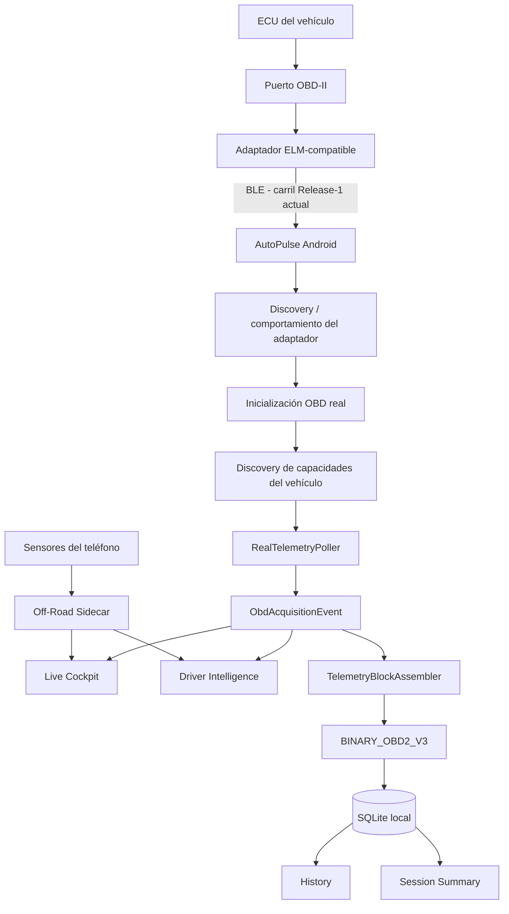

# AutoPulse — Documentación Técnica Extensa 🚗⚡

**Estado:** descripción técnica vigente del producto AutoPulse Live v1
**Autoridad detallada de diseño:** `docs/design/AUTOPULSE_SYSTEM_DESIGN.md`
**Arquitectura de documentación:** `docs/README.md`

Este documento reemplaza la descripción histórica centrada en FastAPI/MongoDB/WebSocket/Isolation Forest como arquitectura principal. Esos componentes pueden permanecer en el repositorio como experimentos o trabajo futuro, pero **no son dependencia central del runtime actual de AutoPulse Live v1**.

---

## 1. Qué es AutoPulse hoy

AutoPulse es una aplicación Android local-first orientada a:

1. conectarse de forma read-only a un vehículo mediante un adaptador OBD compatible;
2. descubrir qué puede hacer realmente el adaptador;
3. descubrir qué capacidades estándar expone realmente el vehículo;
4. esperar evidencia ECU válida antes de afirmar que la telemetría está Live;
5. mostrar datos y estados pensados para una pantalla de smartphone;
6. interpretar el contexto del conductor mediante Driver Modes;
7. complementar, cuando corresponde, con sensores del teléfono;
8. persistir sesiones Live localmente;
9. reconstruir History y Session Summary de forma honesta;
10. sobrevivir de manera explícita a interrupciones, desconexiones y reinicios.

La meta comercial futura puede ser amplia, pero el soporte público se limita siempre al envelope físicamente certificado.

---

## 2. Arquitectura runtime actual



Principio esencial:

> La adquisición ECU tiene prioridad. Los sensores del teléfono son un sidecar opcional y nunca deben cortar, reiniciar o ahogar el loop OBD.

---

## 3. Modelo de verdad de datos

AutoPulse no trata todos los números como equivalentes.

### 3.1 ECU_DIRECT

Datos que llegan a través de una respuesta OBD válida de la ECU.

Ejemplos físicamente observados en el programa actual:

- RPM;
- velocidad del vehículo;
- temperatura del refrigerante.

### 3.2 ADAPTER_ORIGIN

Ejemplo principal:

- `ATRV` — voltaje observado por el adaptador.

`ATRV` **no es** PID `0142`.

PID `0142` representa voltaje del módulo/control ECU cuando el vehículo lo soporta y responde válidamente.

### 3.3 PHONE_ORIGIN

Ejemplos:

- pitch/roll a partir del sensor de orientación;
- altitud/location del teléfono;
- heading.

Estos datos nunca se presentan como ECU direct.

### 3.4 DERIVED

Cualquier dato calculado/estimado debe retener la procedencia de sus inputs y no puede presentarse como lectura directa del vehículo.

---

## 4. Discovery de vehículo y señales

AutoPulse separa cuatro tipos de evidencia:

```text
STANDARD_DEFINITION
CAPABILITY_ADVERTISED
PROBE_RESULT
LIVE_OBSERVATION
```

### STANDARD_DEFINITION

AutoPulse conoce una definición/formula validada de un PID o servicio.

Esto no significa que el vehículo lo soporte.

### CAPABILITY_ADVERTISED

El vehículo/ECU anuncia capacidad mediante el mecanismo estándar correspondiente.

### PROBE_RESULT

AutoPulse solicita realmente el parámetro y registra la respuesta concreta.

### LIVE_OBSERVATION

La señal continúa entregando valores utilizables durante una sesión real.

Nunca se debe saltar de “el estándar define este PID” a “este vehículo lo tiene”.

---

## 5. Manejo de `NO_DATA`, timeout y errores

Estos resultados son hechos distintos:

- `NO_DATA` del path OBD;
- TIMEOUT;
- error del adaptador/ELM;
- pérdida física de conexión;
- negative response ECU;
- payload malformado.

El loop operativo puede retirar un PID después de repetidos `NO_DATA` según la política implementada, pero ese retiro de polling no reescribe la historia de capacidades del vehículo.

Un TIMEOUT no se transforma automáticamente en “PID no soportado”.

---

## 6. Inicialización y protocolo

La app puede completar configuración del adaptador antes de obtener la primera lectura ECU real.

Por eso el estado correcto es:

```text
adapter ready
→ vehicle/protocol ready
→ WAITING FOR FIRST ECU SAMPLE
→ valid ECU reading
→ healthy Live
```

`A0` indica selección automática/provisional del protocolo en la semántica ELM. No debe mostrarse como si fuera un protocolo físico final resuelto por sí mismo.

Los sentinels internos desconocidos, por ejemplo ECU `-1`, no deben llegar a UI.

---

## 7. Live ECU truth

La interfaz distingue entre:

- conectado pero esperando evidencia ECU;
- evidencia ECU demorada;
- Live saludable;
- recording degradado;
- session interrumpida.

Cualquier lectura OBD ECU directa válida puede desbloquear Live; RPM no es el único posible gatillo.

`ATRV` solo no puede desbloquear Live ECU.

---

## 8. Cockpit mobile-first

El producto se usa en smartphone, no en tablet.

La jerarquía visual actual busca:

```text
alerta importante
→ vehículo + timer
→ métricas principales
→ contexto del modo
→ trends/detalles
```

### Estado saludable

Debe ser silencioso visualmente.

No se necesita un banner grande permanente `LIVE · ECU DATA` cuando el usuario ya está en Live y los datos se mueven.

Se usa una indicación sutil de salud/flujo.

### Estados excepcionales

Esperas, degradaciones, interrupciones y estados críticos sí usan color y mensajes más fuertes.

---

## 9. Voice + color + haptics

AutoPulse busca funcionar como copiloto, no como tabla OBD.

### Verde

Normal/healthy/available.

Generalmente silencioso.

### Ámbar / naranja

Waiting, partial, degraded o atención.

Puede usar voz si existe significado/actionability real.

### Rojo

Interrupción, error terminal o condición crítica.

Debe ser difícil de ignorar y puede combinar:

- UI fuerte;
- haptic;
- voz corta.

### Política de voz

Hablar en transiciones relevantes:

- warning serio;
- interrupción inesperada;
- diagnóstico importante;
- recovery significativo;
- startup briefing cuando existe suficiente evidencia.

No hablar continuamente RPM, velocidad o pequeñas variaciones.

La voz debe explicar significado y acción, no recitar PIDs.

---

## 10. Driver Modes

Actualmente se trabaja con:

- Essential;
- Family / Daily;
- Performance;
- Off-Road;
- Diagnostic.

Los modos cambian qué evidencia se prioriza, no cambian la verdad de los datos.

Un modo no puede aparecer READY si sus dimensiones necesarias están degradadas o ausentes.

---

## 11. Off-Road

Off-Road combina telemetría ECU con contexto del teléfono.

### Fuentes posibles

ECU:

- RPM;
- velocidad;
- coolant;
- otras señales disponibles.

Teléfono:

- pitch;
- roll;
- altitude;
- heading.

### Calibración

El teléfono mide su propia orientación. Para hablar de “vehicle-relative attitude” se necesita:

```text
orientación raw del teléfono
→ referencia de nivel calibrada para el vehículo
→ pitch/roll relativo al vehículo
```

Antes de calibrar no se debe fingir que el valor es vehicle-relative.

### RC4 isolation

La prueba Duster RC3 mostró que entrar a Off-Road podía desestabilizar la conexión/datos ECU aunque Essential/Family/Performance funcionaban.

La investigación detectó dos riesgos reales:

1. request de permiso Android de location durante una sesión ACTIVE;
2. exceso de eventos sensor → JS → React/context compitiendo con timing ELM.

RC4 corrige ambos:

- no abre permiso Android dentro de Live;
- si el permiso no existe, degrada solo altitude/location;
- reduce frecuencia native de rotación;
- aplica throttling JS;
- publica contexto de sensores al Driver Intelligence a baja frecuencia;
- mantiene adquisición ECU como path prioritario.

---

## 12. Persistencia de sesión

Cada resultado de adquisición se mapea a eventos y luego a bloques persistibles.

### Pipeline

```text
CommandResult
→ ObdAcquisitionEvent
→ TelemetryBlockAssembler
→ BINARY_OBD2_V3 codec
→ commit queue
→ SQLite
```

La persistencia está diseñada para poder reconstruir lo que realmente sobrevivió, no para inventar el tail perdido.

---

## 13. Stop normal

Flujo esperado:

```text
ACTIVE
→ STOPPING
→ detener poller
→ pequeña gracia al comando in-flight
→ flush del último bloque
→ drain bounded de persistencia
→ COMPLETED
→ Session Summary
```

El último bloque puede ser más corto que la ventana fija.

RC4 corrige un bug semántico encontrado físicamente en Duster: ese último bloque corto no debe convertir automáticamente toda la sesión en `PARTIAL`.

---

## 14. Interrupciones

### APP_BACKGROUND

Release-1 es foreground-only.

Si la app deja foreground durante ACTIVE:

```text
ACTIVE
→ INTERRUPTED / APP_BACKGROUND
```

No se afirma recording continuo en background.

### DEVICE_DISCONNECTED

Desconectar físicamente el adapter debe producir un único terminal interruption y conservar lo ya persistido.

Aún requiere cierre físico del gate en el candidato estabilizado.

### Process kill

No se confía en un callback JS mágico al matar el proceso.

Al siguiente launch:

```text
bootstrap DB
→ detectar sesiones huérfanas
→ leer bloques durables
→ reconciliar counters/sequence/end
→ INTERRUPTED / UNEXPECTED_APP_TERMINATION
```

---

## 15. History

History usa la base local real y muestra:

- vehículo;
- status;
- fecha/hora;
- duración;
- blocks;
- readings;
- termination reason;
- session ID corto;
- acceso a Summary reconstruido.

Se observaron físicamente sesiones completed e interrupted persistiendo en el Logan.

---

## 16. Session Summary

El Summary se reconstruye de la evidencia persistida.

Estados de integridad:

### COMPLETE

Evidencia completa y consistente según reglas.

### PARTIAL

Interrupción o evidencia parcialmente completa según semántica definida.

### DEGRADED

Gaps, mismatch de bloques, corrupción parcial o codec unsupported sin pérdida total.

### CORRUPTED

Evidencia persistida no utilizable a nivel definido.

### UNAVAILABLE

No existen bloques utilizables.

### TextDecoder / Hermes

La primera prueba Logan encontró:

```text
Property 'TextDecoder' doesn't exist
```

porque Node/Jest tenía una API que Hermes Android no garantizaba.

RC3 añadió un path UTF-8 seguro y la prueba Duster posterior abrió un Summary real correctamente.

---

## 17. Evidencia física actual

### Renault Logan 2014

Observado:

- conexión/initialization física;
- ECU Live;
- RPM/speed/coolant en el programa de pruebas;
- adapter voltage separado;
- Off-Road phone sensors;
- APP_BACKGROUND explícito;
- History completed/interrupted.

Defectos históricos:

- TextDecoder Summary;
- UI terminal todavía parecía activa tras interrupción.

RC3 contiene las correcciones.

### Renault Duster 2014

Con el mismo adapter:

- initialization física;
- waiting → first ECU sample;
- RPM;
- speed;
- coolant;
- Essential/Family/Performance;
- RPM trend;
- Summary reconstruido.

Defectos RC3:

- Off-Road podía romper/desestabilizar ECU/session;
- Stop normal aparecía Session PARTIAL.

RC4 corrige ambos en código/CI; falta la prueba física enfocada.

---

## 18. RC4 exact artifact

Target congelado para la próxima prueba Duster:

- commit `4f463a0925cc069b5e835a430132da9e9b9ab092`;
- PR #37;
- Mobile Verify SUCCESS;
- Android APK PR Build SUCCESS;
- artifact ID `9546933827`;
- APK SHA-256 `437181487c0591e3083364accf1e38129af219b1a90227c8612026fbee4ee493`.

CI PASS no equivale a physical PASS.

---

## 19. Compatibilidad

El mismo adapter funcionó físicamente en Logan 2014 y Duster 2014.

Eso aporta evidencia de que el runtime no está limitado a un único vehículo exacto.

Pero aún no permite afirmar:

- todos los Renault;
- todas las marcas;
- todos los adapters;
- todos los protocolos;
- todos los conectores.

Falta:

- vehículo no Renault;
- segundo adapter/conector cuando esté disponible;
- más Android device/version;
- corpus 11-bit/29-bit/ISO-TP y casos degraded/unsupported suficientemente certificados.

---

## 20. Backend histórico / futuro

Los componentes FastAPI/MongoDB/Web dashboard existentes en el repo no son autoridad del Live v1 actual.

No se debe volver a convertirlos en dependencia del producto sin una nueva promoción explícita:

```text
brainstorming
→ design
→ plan
→ build
→ test
```

---

## 21. Sistema documental del repositorio

```text
docs/
├── brainstorming/
├── design/
├── plan/
├── build/
├── test/
├── mining-site/
│   └── quarries/
├── golden-dataset/
└── release/
```

### Autoridad

- Brainstorming: ideas no autoritativas.
- Design: comportamiento aceptado.
- Plan: gates y orden de ejecución.
- Build: qué código existe.
- Test: qué se verificó.
- Quarries: evidencia fuente.
- Golden Dataset: evidencia normalizada aprobada/candidata.
- Release: qué se puede prometer.

El documento canónico para esta política es `docs/README.md`.

---

## 22. Estado de salida actual

```text
P0 foundation                         ✅
Logan real acquisition               ✅ observed
Duster real acquisition              ✅ observed
RC3 Summary reconstruction           ✅ observed on Duster
Phone-first Live                     ✅ implemented
Voice/color/haptic framework         ✅ implemented / validating
RC4 Off-Road isolation               ✅ code + CI
RC4 clean-stop semantics             ✅ code + CI
RC4 Duster retest                    ⏳ next
Physical BLE-unplug                  ⏳
Process-kill recovery physical gate  ⏳
Cross-manufacturer evidence          ⏳
Second adapter/connector evidence    ⏳
Public v1                            🔒 not certified yet
```

La prioridad siguiente es cerrar Q-003 con el artifact RC4 exacto, no agregar features nuevas.
