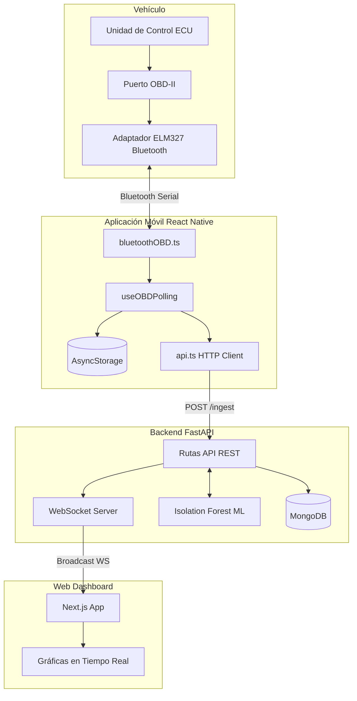
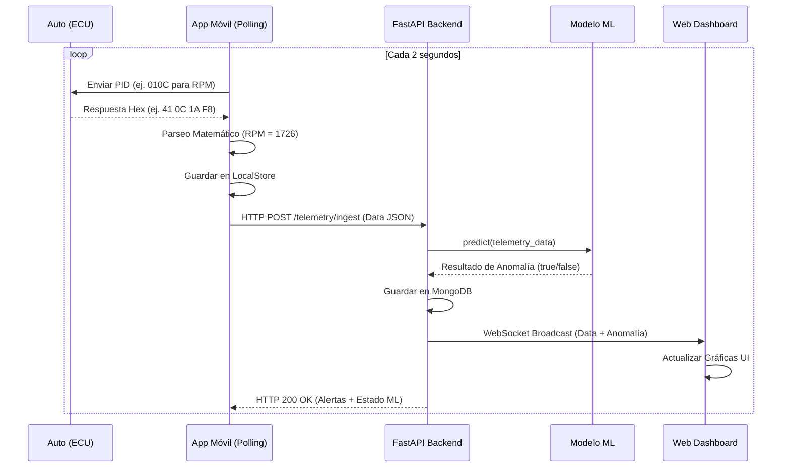
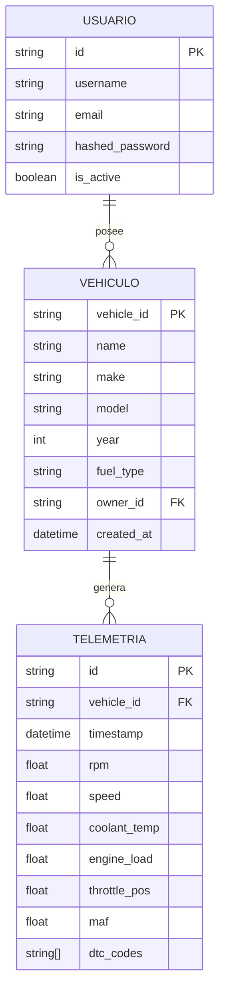
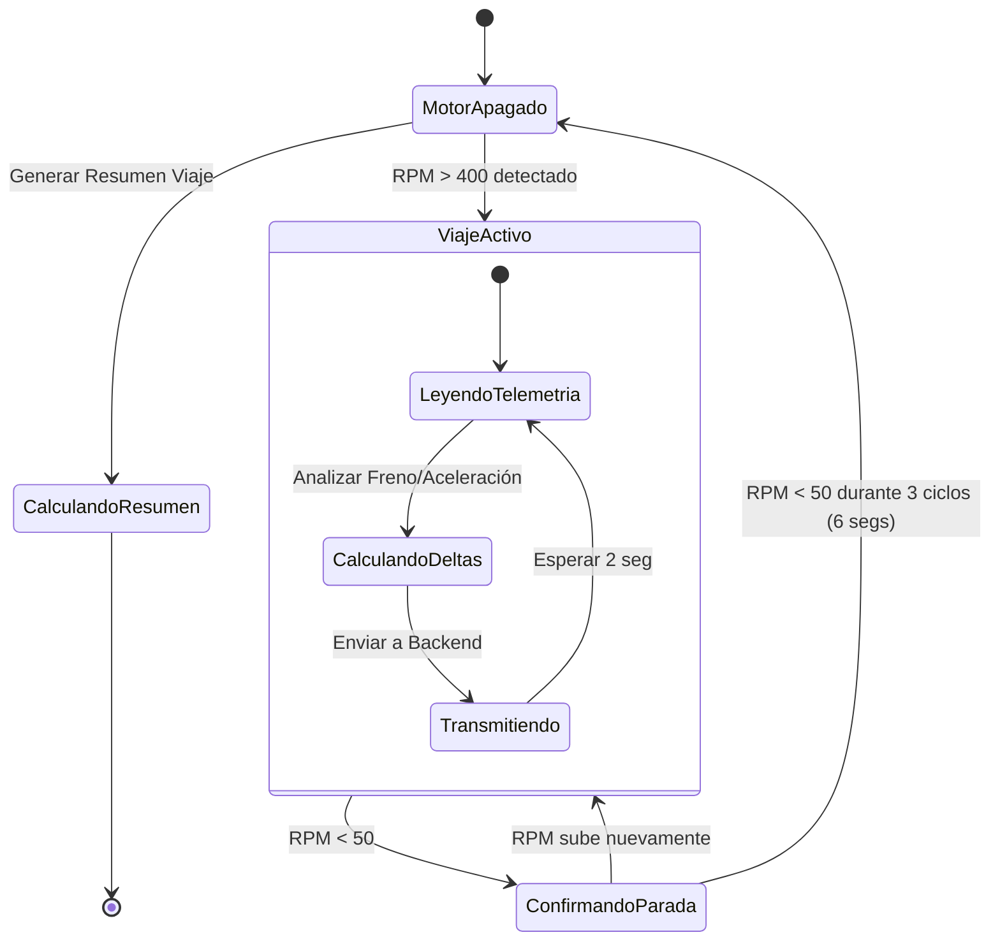

# AutoPulse - Documentación Técnica Extensa y Visual 🚗⚡

Este documento describe detalladamente la arquitectura, flujo de datos y componentes internos de la plataforma **AutoPulse**.

---

## 1. Arquitectura General del Sistema

El sistema está dividido en tres actores principales:
1. **Vehículo (ECU)** + Adaptador Bluetooth (ELM327)
2. **Aplicación Móvil (React Native)** - Actúa como puente y procesador primario.
3. **Backend y Web (Python + Next.js)** - Almacenamiento, Machine Learning, y visualización global.



---

## 2. Flujo de Secuencia (Ingesta de Telemetría)

¿Cómo viaja la información desde el motor hasta el dashboard web en tiempo real?



---

## 3. Modelo de Datos (Base de Datos)

Aunque MongoDB es NoSQL, internamente manejamos los siguientes modelos estructurados con `Pydantic` en el backend:



---

## 4. Lógica de Detección Automática de Viajes (Trip Detection)

La aplicación móvil no requiere que el usuario presione "Iniciar Viaje". Utiliza una máquina de estados basada en las RPM del motor:



---

## 5. Machine Learning - Isolation Forest

En lugar de usar alertas estáticas rígidas (ej. "RPM > 5000 = peligro"), el backend utiliza `Isolation Forest` de `Scikit-Learn`.

```mermaid
flowchart LR
    A[Datos Históricos\n(1 semana min)] -->|Entrenamiento| B(Isolation Forest)
    B --> C{Modelo Entrenado}
    
    D[Nueva Lectura OBD] --> C
    C -->|Puntaje Anomalía < 0| E[Alerta: Comportamiento Atípico]
    C -->|Puntaje Anomalía > 0| F[Operación Normal]
```

El algoritmo traza los puntos de la telemetría en un plano multidimensional. Si una lectura es fácil de "aislar" del resto del conjunto (ej. alta temperatura combinada con alta carga del motor a muy baja velocidad), el modelo la clasifica como una anomalía.

---

## 6. Estado Pendiente a Implementar

Para llegar a este nivel de automatización, aún se requieren implementar las siguientes fases técnicas (Deuda Técnica actual):

1. **API Client (`api.ts`)**: Crear el puente HTTP en React Native.
2. **Auth Flows**: Autenticación en la App (Login/Registro).
3. **Dashboard Web**: Programar los dashboards y gráficas usando WebSockets en Next.js.
4. **Infraestructura**: Desplegar la base de datos (MongoDB) y el entorno en FastAPI.
