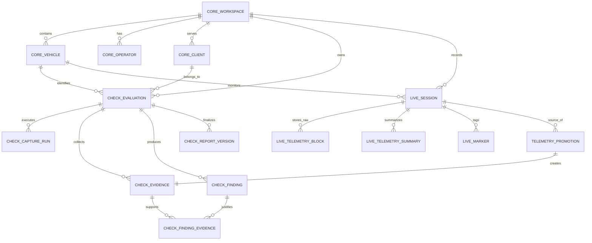

# Diseño Lógico y Arquitectura de Persistencia (APC-03)

De acuerdo a la resolución del gate, este documento constituye el **modelo lógico completo y el mapa de agregados** que gobernará la persistencia productiva de AutoPulse (SQLite + Drizzle), respetando íntegramente los contratos definidos en APC-01 y la visión comercial de separación estricta entre Check y Live.

## 1. Mapa de Agregados y Ownership

El modelo se divide en tres contextos fundamentales (Bounded Contexts):

* **Contexto CORE (Identidad Compartida):**
  * Agregado Raíz: `Workspace` (Taller / Cuenta).
  * Entidades: `Operator` (Técnico / Usuario), `Vehicle` (Vehículo físico), `Client` (Propietario).
  * *Ownership:* Compartido. Live y Check consumen este contexto, pero no son dueños de él.

* **Contexto CHECK (Línea Profesional):**
  * Agregado Raíz: `Evaluation` (Expediente).
  * Entidades hijas: `CaptureRun` (Captura OBD), `EvidenceItem` (Evidencia), `Finding` (Hallazgo), `FindingEvidence` (Unión), `TriageExecution` (Ejecución de triaje), `ReportDraft`, `ReportVersion`, `ReportManifest`.
  * *Ownership:* Totalmente encapsulado. La evaluación es dueña de su evidencia y hallazgos. Inmutabilidad estricta tras la firma.

* **Contexto LIVE (Experiencia Telemetría):**
  * Agregado Raíz: `LiveSession` (Sesión temporal).
  * Entidades hijas: `TelemetryBlock` (Raw payload), `TelemetryBlockSummary` (Estadísticas), `Marker` (Marca del usuario), `Alert` (Alerta generada), `SessionSignal` (Señales vinculadas).
  * Entidad maestra: `SignalDefinition` (Catálogo base).
  * *Ownership:* Optimizado para volumen y purga.

* **Puente de Promoción:**
  * Entidad: `TelemetryEvidencePromotion`.
  * *Responsabilidad:* Trazabilidad inmutable entre `LiveSession` y `EvidenceItem` (Check).

## 2. Diagrama Entidad-Relación (ERD Conceptual)

## 3. Diccionario de Tablas y Campos (Catálogo Mínimo)

*Las tablas utilizarán el prefijo del contexto.*

**Contexto CORE:**
* `core_workspaces`: `id`, `name`, `created_at`.
* `core_operators`: `id`, `workspace_id`, `name`, `role`, `created_at`.
* `core_vehicles`: `id`, `workspace_id`, `vin`, `make`, `model`, `year`, `created_at`.
* `core_clients`: `id`, `workspace_id`, `name`, `contact_info`, `created_at`.

**Contexto CHECK:**
* `check_evaluations`: `id`, `workspace_id`, `vehicle_id`, `client_id`, `operator_id`, `state`, `scope`, `coverage`, `symptoms`, `limitations`, `created_at`, `opened_at`, `signed_at`, `cancelled_at`, `deleted_at`.
* `check_capture_runs`: `id`, `evaluation_id`, `state`, `started_at`, `ended_at`, `type`.
* `check_evidence`: `id`, `evaluation_id`, `capture_run_id`, `origin` (LIVE_TELEMETRY_WINDOW, OBD_READ, CAMERA), `type`, `local_reference`, `payload_hash`, `time_window_start`, `time_window_end`, `metadata_json`, `author_id`, `created_at`.
* `check_findings`: `id`, `evaluation_id`, `source`, `state`, `severity`, `confidence`, `proposed_rule`, `technical_explanation`, `client_explanation`, `suggested_action`, `limitations`, `created_at`.
* `check_finding_evidence`: `finding_id`, `evidence_id`.
* `check_triage_executions`: `id`, `evaluation_id`, `executed_at`, `result_json`.
* `check_report_drafts`: `id`, `evaluation_id`, `updated_at`, `content_json`.
* `check_report_versions`: `id`, `evaluation_id`, `version_number`, `frozen_snapshot_json`, `created_at`.
* `check_report_manifests`: `id`, `report_version_id`, `signature`, `generated_at`.

**Contexto LIVE:**
* `live_sessions`: `id`, `workspace_id`, `vehicle_id`, `operator_id`, `state`, `preset`, `recording_policy`, `retention_class`, `capability_snapshot`, `started_at`, `ended_at`, `interruption_reason`, `pinned_at`, `purge_after_at`, `created_at`.
* `live_signal_definitions`: `id`, `technical_name`, `commercial_name`, `description`, `unit`, `category`, `expected_origin`, `acquisition_id`, `security_relevant`.
* `live_session_signals`: `session_id`, `signal_definition_id`.
* `live_telemetry_blocks`: `id`, `session_id`, `sequence_number`, `window_start`, `window_end`, `sample_count`, `signal_count`, `payload_format`, `payload_schema_version`, `compression_codec`, `payload_blob`, `uncompressed_size_bytes`, `stored_size_bytes`, `content_hash`, `quality_summary`, `created_at`.
* `live_telemetry_block_summaries`: `id`, `session_id`, `signal_definition_id`, `window_start`, `window_end`, `min_val`, `max_val`, `avg_val`, `last_val`, `valid_samples`, `degraded_samples`, `time_under_criteria`.
* `live_markers`: `id`, `session_id`, `timestamp`, `note`.
* `live_alerts`: `id`, `session_id`, `timestamp`, `severity`, `description`.

**Contexto PUENTE:**
* `telemetry_evidence_promotions`: `id`, `evidence_id`, `source_session_id`, `source_window_start`, `source_window_end`, `source_window_hash`, `promoted_by`, `promoted_at`, `promotion_key` (Unicidad).

## 4. Matriz de Cardinalidades
* `Workspace` (1) -> (N) `Vehicle` | `Client` | `Operator` | `Evaluation` | `LiveSession`.
* `Evaluation` (1) -> (N) `CaptureRun` | `Evidence` | `Finding` | `ReportVersion`.
* `LiveSession` (1) -> (N) `TelemetryBlock` | `Marker` | `Alert`.
* `Finding` (N) <-> (M) `Evidence` (Mediante `FindingEvidence`).
* `LiveSession` (1) -> (N) `TelemetryPromotion` -> (1) `Evidence`.

## 5. Estrategia de IDs
* **Formato:** Opacos, globalmente únicos y ordenables. Se emplearán **ULID** (Universally Unique Lexicographically Sortable Identifier) o UUIDv7, generados en la capa de aplicación (Dominio/Infraestructura TS), no en SQLite.
* **Justificación:** AutoPulse es offline-first y comercial. Requiere exportación/importación sin colisiones de IDs autoincrementales.

## 6. Convención de Timestamps
* **Formato:** Enteros (INTEGER en SQLite) representando **milisegundos Unix (Epoch en UTC)**.
* No se usarán strings ISO-8601 en la base de datos para fechas indexables, asegurando ordenamiento y consultas de rango veloces (crítico para las ventanas de telemetría).

## 7. Matriz de Índices Estratégicos
* `check_evaluations`: Índice sobre `(workspace_id, vehicle_id)` y `(state)`.
* `live_sessions`: Índice sobre `(purge_after_at)` (para el job de retención) y `(pinned_at)`.
* `live_telemetry_blocks`: Índice compuesto sobre `(session_id, sequence_number)` y `(session_id, window_start, window_end)`.
* `telemetry_evidence_promotions`: Índice UNIQUE sobre `promotion_key` (hash determinista: `session_id + window_start + window_end + evaluation_id`).

## 8. Matriz de `ON DELETE`
* **CORE a CORE:** `RESTRICT`. Un Workspace no se borra si tiene clientes.
* **CORE a CHECK:** `RESTRICT`. No se puede borrar físicamente un vehículo si tiene evaluaciones históricas.
* **CORE a LIVE:** `CASCADE`. Si un vehículo se borra de manera definitiva, su telemetría pura (no promovida) se elimina.
* **CHECK a CHECK:** `CASCADE`. Borrar un borrador elimina sus relaciones; sin embargo, *Check* operará casi exclusivamente mediante Soft Delete (`deleted_at`), por lo que los CASCADE físicos rara vez se invocarán.
* **LIVE a LIVE:** `CASCADE`. Borrar una `LiveSession` destruye todos sus `TelemetryBlocks`, `Summaries`, `Markers` y `Alerts`.
* **LIVE a PROMOTION:** `SET NULL` en `source_session_id`. Si se purga la sesión Live, la promoción retiene la evidencia inmutable en Check, pero pierde la traza a la sesión de origen (o la retiene lógicamente si aplicamos soft delete a la cabecera de sesión).

## 9. Política de Retención
La purga física estará regulada mediante un job en background:
1. **Telemetría Temporal (`purge_after_at` establecido):** Se elimina físicamente (`CASCADE`) una vez cumplida la fecha.
2. **Sesión Fija (`pinned_at != null`):** Retenida indefinidamente en el dispositivo.
3. **Promovida / Exportada:** Telemetría cruda sujeta a purga según espacio; cabecera (`live_sessions`) conservada como trazabilidad mínima.
4. **Protegida por plan comercial:** Retención ampliada (definida por lógica de suscripción futura).

## 10. Formato Versionado del Bloque de Telemetría (Payload)
El `payload_blob` (Blob SQLite) estará gobernado por:
* `payload_format`: e.g., `"JSON_ARRAY"`, `"PROTOBUF"`, `"BINARY_CHUNKS"`.
* `payload_schema_version`: e.g., `"1.0"`. Define la estructura interna.
* `compression_codec`: `"NONE"`, `"GZIP"`, `"LZ4"`.
Esto garantiza que la lectura histórica sea retrocompatible sin acoplar la base de datos a un único codec.

## 11. Política de Archivos y Evidencias Audiovisuales
* **Almacenamiento:** Fotografías, videos y PDFs residirán en el `FileSystem` nativo del dispositivo (ej. `expo-file-system` documentDirectory).
* **Base de Datos:** La tabla `check_evidence` solo guardará el `local_reference` (URI relativa) y el `payload_hash` (SHA-256 del archivo).
* **Integridad:** El FileSystem es volátil. El hash criptográfico asegurará que la evidencia no haya sido manipulada (cadena de custodia).

## 12. Flujo Transaccional de Promoción
Para proteger la invariante de "Evaluaciones Firmadas", la promoción no dependerá de un simple Trigger. El Repositorio orquestará:
1. `BEGIN TRANSACTION`.
2. `SELECT state FROM check_evaluations WHERE id = ?`.
3. Si `state == SIGNED`, lanzar `DomainError` (ROLLBACK).
4. Ensamblar `check_evidence` (congelando el payload de la ventana Live temporal o copiándolo de `live_telemetry_blocks`).
5. `INSERT INTO check_evidence`.
6. `INSERT INTO telemetry_evidence_promotions` (falla si el Unique `promotion_key` ya existe).
7. `COMMIT`.

## 13. Estrategia de Migraciones Productivas
* **Inicio:** `0000_initial_prod_schema.sql` modelará todo el Catálogo de Tablas en un solo paso.
* **Separación de Ambientes:** `autopulse.db` será la productiva. `autopulse_test.db` se usará para Jest/E2E.
* **Generación:** `drizzle-kit generate` continuará siendo la fuente de verdad. Las migraciones no serán destructivas tras el paso a producción.

## 14. Plan de Benchmark Nativo
Antes de fijar tamaños de bloque para `live_telemetry_blocks`, APC-03 exigirá un Benchmark en dispositivo real:
* **Simulación:** Generar 10-20 señales a 10Hz durante 30 minutos ininterrumpidos.
* **Escritura:** Escribir bloques temporales (ej. cada 1 segundo vs cada 5 segundos) y medir consumo de I/O y pérdida de frames.
* **Consulta:** Consultar `live_telemetry_block_summaries` vs parsear `payload_blob` masivamente.
* **Compresión:** Medir tiempo de compresión (LZ4/GZIP) vs impacto en CPU/Batería.
El resultado de este benchmark (APC-03.X) determinará el `payload_format` y `compression_codec` definitivo.

## 15. Clasificación de Privacidad
* **Personal Identifiable Information (PII):** `core_clients` (contact info), `core_vehicles` (VIN), `live_sessions` (Rutas GPS, si aplica).
* **Sensibilidad Comercial:** `check_evaluations`, `check_reports`.
* **Exportabilidad:** Toda evaluación debe poder empaquetarse (Zip con SQLite parcial + Archivos) para el dueño.
* **Sanitización:** Los exports técnicos (para soporte de AutoPulse) excluirán automáticamente `core_clients` y `live_sessions` con GPS.
